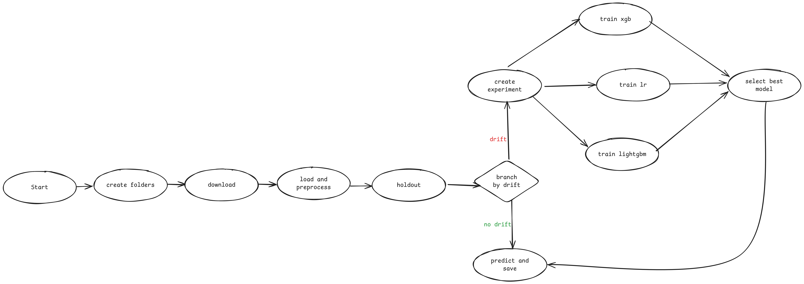
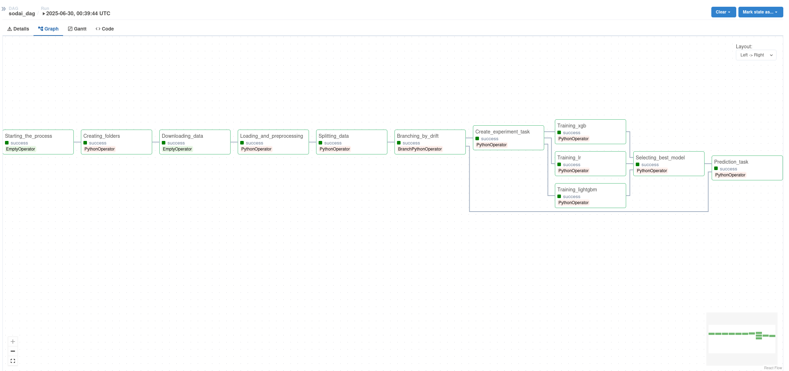

# Documentación detallada del DAG de Airflow

> Video de ejecución de DAG: https://youtu.be/GRfZ5nWzgVY

## Instrucciones de ejecución

Para ejecutar el contenedor de docker con este proyecto se requiere situarse en una consola en el directorio que contiene este documento (`/airflow/`), asegurarse de que existen las carpetas `/airflow/predictions`, `/airflow/mlruns` y `/airflow/data` con los archivos `/airflow/data/historic.parquet` y `/airflow/data/week.parquet`, y seguir los siguientes pasos.

1. Buildear la imagen: `docker build -t sodai . `

2. Ejecutar el contenedor: `docker run -p 8080:8080 -v $(pwd)/mlruns:/mlruns:rw -v $(pwd)/data:/data:rw -v $(pwd)/predictions:/predictions:rw --name sodai-container sodai`

3. Acceder a la interfaz de Airflow en `http://0.0.0.0:8080`

## Descripción de funcionalidades del DAG

A continuación, se describe la funcionalidad de cada tarea definida en el DAG:

1. `start_task` (task_id="Starting_the_process"): Tarea dummy para inicializar el DAG.

2. `folder_task` (task_id="Creating_folders"): Tarea para crear las carpetas que usará el DAG durante su ejecución. Se determina si las carpetas existen antes de crearlas, para evitar errores.
    
3. `download_task` (task_id="Downloading_data"): Tarea dummy (`EmptyOperator`) para representar en que momento se estarían descargando los archivos `week.parquet`.

4. `load_preprocess_data_task` (task_id="Loading_and_preprocessing")
    Carga los datos de `historic.parquet` y `week.parquet` desde `/data` creando los archivos con los documentos ya preprocesados `historic.parquet`, `grouped_week.parquet` y `predict.parquet` en la carpeta `<fecha y tiempo de ejecucion>/preprocessed/`; historic y grouped_week contienen las filas preprocesadas de historic.parquet y week.parquet respectivamente, mientras que predict.parquet es un archivo que contiene los datos a predecir para la próxima semana. Además, reemplaza el archivo `historic.parquet` de la carpeta `data` con su versión actualizada, agregando la nueva semana recibida.

5. `split_data_task` (task_id="Splitting_data")
    Carga los datos preprocesados en la tarea anterior, creando los conjuntos de entrenamiento(`train.parquet`) y validación(`val.parquet`) y guardándolos en la carpeta `splits` de la misma fecha del DAG anterior. Se agregan los datos obtenidos en la ejecución al histórico, para así poder incluirlos al momento de hacer la evaluación.

6. `branch_by_drift_task` (task_id="Branching_by_drift")
    Se intenta cargar el modelo desde mlflow, si no hay modelo se pasa inmediatamente a la tarea de setup del experimento. En el caso de que exista un modelo de alias *current* en el registro de modelos, éste se carga junto al `f1-score` obtenido durante su entrenamiento para posteriormente evaluar sobre el conjuto de validación definido en la tarea anterior y comparar con un nuevo `f1-score`. Si existe *drift* respecto a la `f1-score` anterior, se pasa a la tarea de setup de experimento. Si no ocurren los dos escenarios anteriormente descritos, se pasa directamente a predecir.

7. `setup_experiment_task` (task_id = "Create_experiment_task")
    Se crea un experimento común de nombre `train_<fecha y hora de creacion de experimento>` y se hace `push` de su id de experimento a XCom.

8. Entrenamiento
    Se hace `pull` de la id de experimento de la ejecución actual, para así poder registrar las runs de las tres tareas de entrenamiento. Se hacen tres estudios de optuna en tres tareas en paralelo para regresión logística, xgboost y lightgbm y se registran sus parámetros y métrica de `f1-score`.
    a. `train_lr_task` (task_id="Training_lr") Realiza el entrenamiento de Regresión Logística, según lo descrito previamente.
    b. `train_xgb_task` (task_id = "Training_xgb") Realiza el entrenamiento de XGBoost, según lo descrito previamente.
    c. `train_lgbm_task` (task_id = "Training_lightgbm") Realiza el entrenamiento de LightGBM Classifier, según lo descrito previamente.

9. `select_best_model_task` (task_id='Prediction_task')
    En esta tarea, nuevamente se hace pull de la id de experimento registrada anteriormente para poder acceder a todas las runs registradas con anterioridad, y se busca en todas las runs de las tres tareas de entrenamiento y optimización de hiperparámetros para seleccionar el modelo con mejor f1_score. Este modelo se guarda en el registro de modelos bajo el nombre `best_model` y alias `current`.

10. `predict_task` (task_id='Prediction_task')
    Como última tarea se realizan las predicciones para los valores de la siguiente semana. Se carga el archivo `predict.parquet` que definimos con anterioridad y se carga el modelo de alias `current` presente en el registro de modelos de mlflow para así hacer las predicciones y entregar un archivo de valores separados por comas con las ids de los clientes y productos que comprarán la próxima semana de acuerdo a nuestro modelo, en la ruta `/predictions/<fecha>.csv`.

  ## Diagrama de flujo y representación visual del DAG en Airflow

A continuación, se presenta el diagrama de flujo del DAG, construído durante la etapa de diseño del pipeline de Airflow

Además, se presenta una imagen tomada de la plataforma de Airflow desplegada con este DAG

## Lógica para integración de futuros datos y detección de drift

En primer lugar, se asume que se cuenta con un dataset histórico `historic.parquet`, y los datasets `clientes.parquet` y `productos.parquet` que se facilitaron en la primera entrega. El documento `historic.parquet` consiste en la data de `transacciones.parquet` procesada junto a la de `clientes.parquet` y `productos.parquet`, agrupada de forma semanal y pasada por un proceso de limpieza, al punto de tener el formato necesario para ser utilizado por el pipeline de predicción de este trabajo. `historic.parquet` se extiende en cada ejecución, pues se asume que el DAG será ejecutado semana a semana con información nueva sobre las transacciones realizadas. Para ello, se utiliza el dataset con la información de la nueva semana $t+1$, `week.parquet`, el cual se lleva al formato de `historic.parquet` y se concatena al final de este, para luego guardarse reemplazando la versión anterior. Así, se integran los futuros datos de forma exitosa.

Para la detección de drift se evalúa el desempeño del modelo con la nueva data recibida y se compara con el obtenido con los datos utilizados durante su entrenamiento, específicamente utilizando la métrica de `f1-score`, que es la que se utiliza para optimizar los hiperparámetros de los modelos y seleccionar el mejor, que posteriormente se usa para predecir. Si es que el `f1-score` obtenido con los nuevos datos empeora respecto al último entrenamiento, se asevera que se detecta drift y se gatilla un nuevo entrenamiento. De lo contrario, se pasa directamente a la etapa de predicción y se usa el modelo existente.